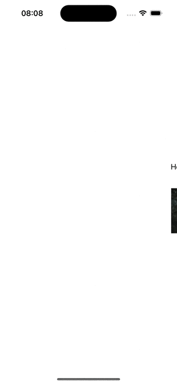

# ScrollingView
`ScrollingView` is a `SwiftUI` View that lets you let a View scrolling across the screen. It can be a `Text`, `Image`, `VStack`... Whatever you want.
<br>

## How to use

```swift
ScrollingView {
    Text("Hello, world!")
}
```
<br>

<br>
<br>
Designed to test different features in SwiftUI Views.<br>
**© Adriano Cosme Rezena | 2023**
